<!--
  Every image under assets/ is drawn by scripts/render.py (stdlib Python, no third-party cards)
  and re-rendered every 6 hours by .github/workflows/profile.yml from live GitHub data.
-->

<div align="center">


<br>

[](https://github.com/RubanSivanandam)
[](https://github.com/RubanSivanandam?tab=followers)
[](https://github.com/RubanSivanandam/Agentic-Unified-Reasoning-Architecture)
[](.github/workflows/profile.yml)



</div>

<h3><code>ruban@agent-os ~ $ cat about.yaml</code></h3>

```yaml
name:      Ruban Sivanandam
role:      AI Engineer @ Ambattur Fashion — AI for garment manufacturing across 4 countries
mission:   put real factory data in front of agents, without ever letting them break it
focus:     [agentic AI, multi-agent orchestration, MCP, RAG, LLM evaluation, AI security]
learning:  in public — one agentic-AI concept a day on LinkedIn
```

<details>
<summary><b><code>$ cat principles.md</code></b> — the rules my systems are built on</summary>
<br>

| # | Principle | What it means in code |
|---|-----------|-----------------------|
| 01 | **A clean build is not verification** | Execute the path: load the page, call the function, run the agent |
| 02 | **Report the number, not the adjective** | "23 of 24 pass at 4.5:1" beats "contrast is fine" |
| 03 | **Guardrails live in code, not prompts** | Writes to production are rejected at parse time, not discouraged |
| 04 | **A test against a mock proves the mock** | Fixtures take their shape from the code that produces the data |
| 05 | **Fail closed** | When a check can't decide, the action doesn't happen |
| 06 | **Humans approve the irreversible** | Agents propose; people sign off on writes and self-modification |

</details>

<div align="center"></div>

<h3><code>ruban@agent-os ~ $ aura swarm --watch</code></h3>

<div align="center">
<a href="https://github.com/RubanSivanandam/Agentic-Unified-Reasoning-Architecture">
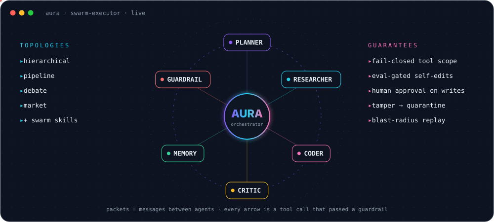
</a>
</div>

<h3><code>ruban@agent-os ~ $ ls ./flagship</code></h3>

<table>
<tr>
<td width="50%"><a href="https://github.com/RubanSivanandam/Agentic-Unified-Reasoning-Architecture">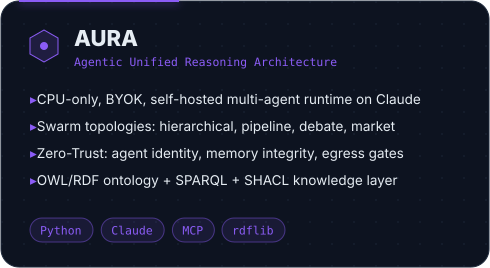</a></td>
<td width="50%"><a href="https://github.com/RubanSivanandam/NodeJS_JWT">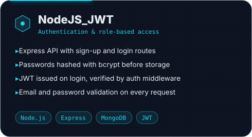</a></td>
</tr>
<tr>
<td width="50%"><a href="https://github.com/RubanSivanandam/NodeJS_CRUD_Backend">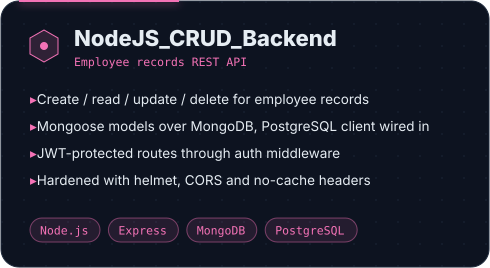</a></td>
<td width="50%"><a href="https://github.com/RubanSivanandam/Angular-17-FrontEnd">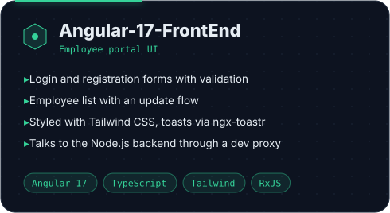</a></td>
</tr>
</table>

<h3><code>ruban@agent-os ~ $ ./pattern --today</code></h3>

<div align="center">
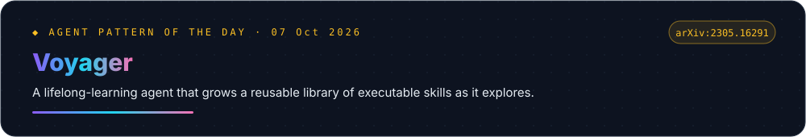
</div>

<div align="center"></div>

<h3><code>ruban@agent-os ~ $ stack.orbit()</code></h3>

<div align="center">
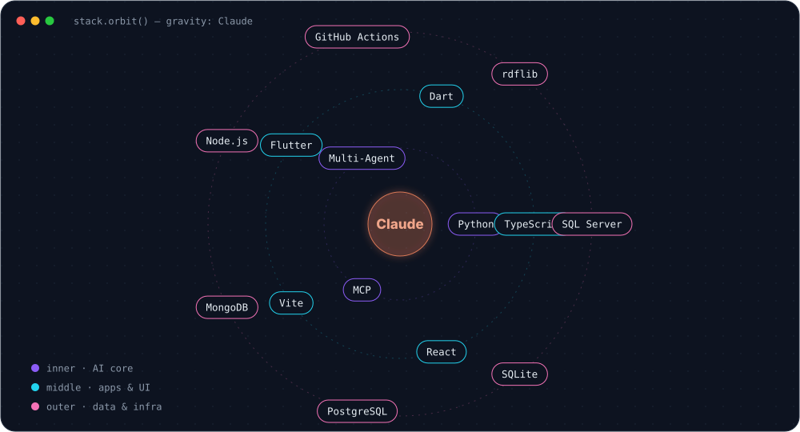
</div>

<h3><code>ruban@agent-os ~ $ ./telemetry --live</code></h3>

<div align="center">

<picture>
  <source media="(prefers-color-scheme: dark)" srcset="https://raw.githubusercontent.com/RubanSivanandam/RubanSivanandam/output/github-snake-dark.svg" />
  <source media="(prefers-color-scheme: light)" srcset="https://raw.githubusercontent.com/RubanSivanandam/RubanSivanandam/output/github-snake.svg" />
  
</picture>
</div>

<h3><code>ruban@agent-os ~ $ tail -f activity.log</code></h3>

<!--ACTIVITY:START-->
- `2026-10-07` ⚡ pushed to [RubanSivanandam](https://github.com/RubanSivanandam/RubanSivanandam)
- `2026-10-07` 🌱 created branch `main` in [RubanSivanandam](https://github.com/RubanSivanandam/RubanSivanandam)
- `2026-09-28` ⭐ starred [awesome-claude-code](https://github.com/hesreallyhim/awesome-claude-code)
- `2026-09-28` ⭐ starred [claude-code-best-practice](https://github.com/shanraisshan/claude-code-best-practice)
- `2026-09-28` ⭐ starred [linkedin-skills](https://github.com/sergebulaev/linkedin-skills)
<!--ACTIVITY:END-->

<details>
<summary><b><code>$ ./stats --third-party</code></b> — the classic cards</summary>
<br>
<div align="center">


</div>
</details>

<div align="center">
</div>
